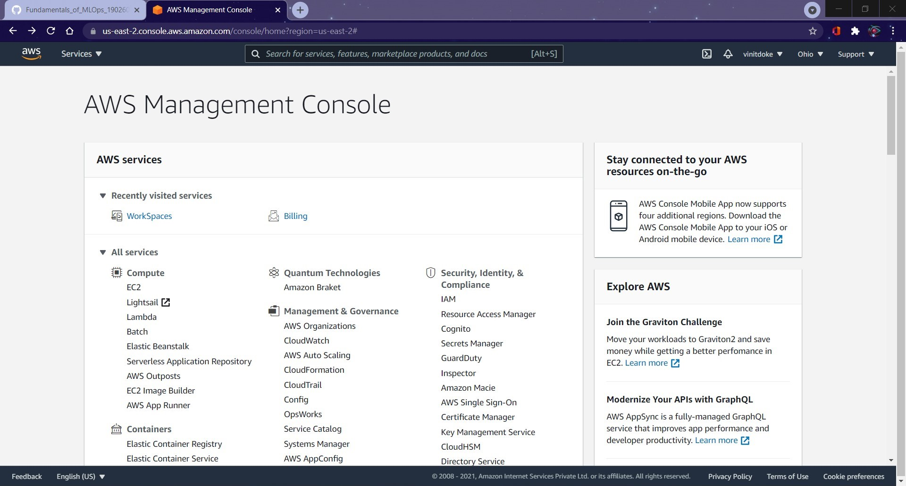

# Assignment 1
## __Part 1__
__Question 1 :__
---
*In the notes of Week 1, we compared & contrasted MLOps with DevOps. In this question, you need to understand what is meant by the term AIOps, & then contrast it with MLOps.*

__Answer :__

AIOps is short for artificial intelligence for IT operations. It refers to multi-layered technology platforms that automate and enhance IT operations through analytics and machine learning (ML). AIOps combines big data and machine learning to automate IT operations processes, including event correlation, anomaly detection and causality determination.

AIOps is generally used in companies that use DevOps or cloud computing and in large, complex enterprises. AIOps aids teams that use a DevOps model by giving development teams additional insight into their IT environment, which then gives the operations teams more visibility into changes in production.

*Au contraire*, MLOps is a multidisciplinary approach to managing machine learning algorithms as ongoing products, each with its own continuous lifecycle. It's a discipline that aims to build, scale, and deploy algorithms to production consistently.

__Question 2 :__
---
*Interpretable Machine Learning is another concept that has attracted lot of attention recently & is promoted by most of the MLOps frameworks. Explain what it means for a linear regression model to be interpretable.*

__Answer :__

A machine learning model is interpretable if we can fundamentally understand how it arrived at a specific decision. The higher the interpretability of a machine learning model, the easier it is for someone to comprehend why certain decisions or predictions have been made. A model is better interpretable than another model if its decisions are easier for a human to comprehend than decisions from the other model.

In case of a Linear Regression Model, 

## __Part 2__
**Screenshot of AWS Console**

