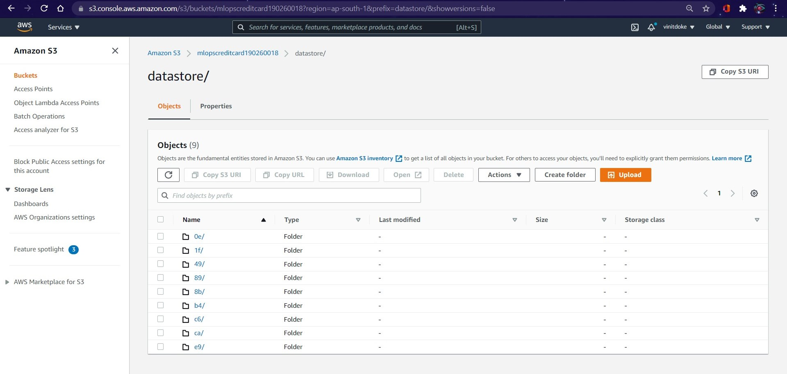

# Assignment 2
## **Link to MLOps_Assignment Repository**:
[https://github.com/vinitdoke/MLOps_Assignment](https://github.com/vinitdoke/MLOps_Assignment) 

## **Part 1**:
List of commands used to set-up a new repository with DVC tracking and remote storage :
```
git clone https://github.com/vinitdoke/MLOps_Assignment.git

dvc init
dvc cache dir ../external_cache
dvc add data/creditcard.csv

git add data\.gitignore
git add data\creditcard.csv.dvc
git commit -m "Added Data"

dvc remote add -d storage s3://mlopscreditcard190260018/datastore

git add .dvc/config
git commit -m "Configured Storage"

dvc push
```
## **Part 2**:
Accuracy and F1 Score of the 2 experiments :
| Experiment|Accuracy|Weighter F1 Score |
| ----------- | ----------- |----------|
| *expt1_dt* : **Decision Tree**| 1.0|1.0|
| *expt2_rf* : **Random Forest**|0.9796696315120712|0.979667661973157 |


Screenshot of **AWS S3 Bucket** after **Part 2**

