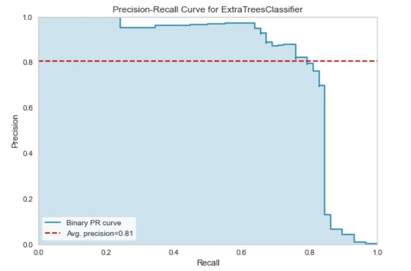
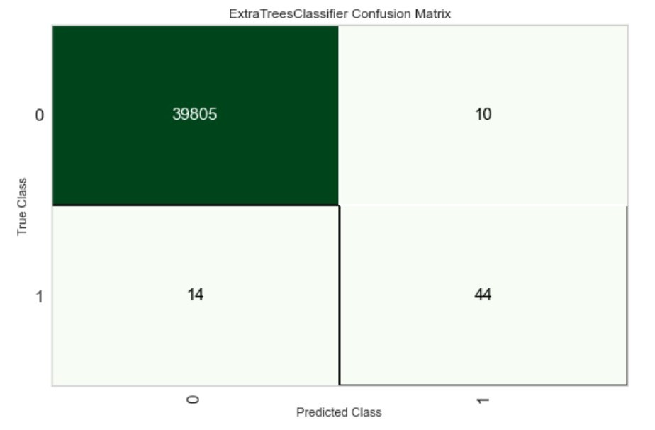

# Assignment 3

## **Link to MLOps_Assignment Repository**:
[https://github.com/vinitdoke/MLOps_Assignment](https://github.com/vinitdoke/MLOps_Assignment)

## **1. Preprocessing Steps :**
1. Fix Imbalance : SMOTE
2. Trignonometry Features
3. Polynomial Features
4. Normalization : minmax

## **2. Top 5 Models**

| Model                           | F1 Score (Before Tuning) | F1 Score (After Tuning) |   |   |
|---------------------------------|--------------------------|-------------------------|---|---|
| Extra Trees Classifier          | 0.8541                   | --                      |   |   |
| Random Forest Classifier        | 0.8199                   | 0.8321                  |   |   |
| Light Gradient Boosting Machine | 0.8160                   | --                      |   |   |
| Decision Tree Classifier        | 0.5171                   | 0.5263                  |   |   |
| K Neighbors Classifier          | 0.4155                   | 0.4160                  |   |   |

## **3. Plots**

## **4. Metrics of Blended Model on Unseen Data**

| Metric    | Value  |
|-----------|--------|
| Accuracy  | 0.9994 |
| Precision | 0.8148 |
| Recall    | 0.7586 |
| F1 Score  | 0.7857 |
